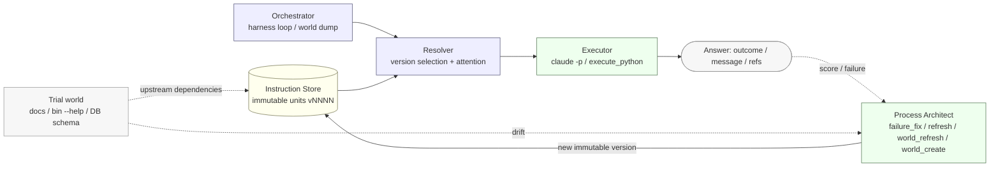
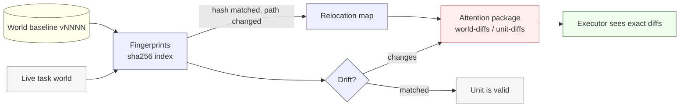
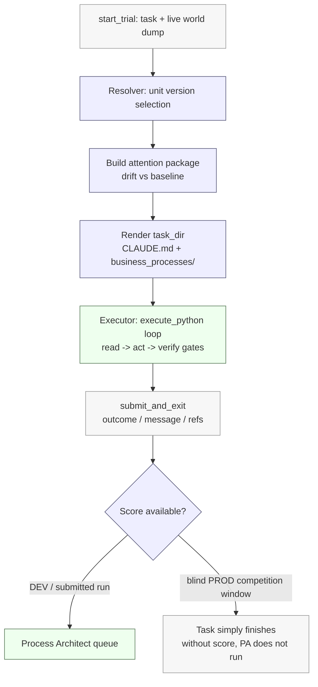
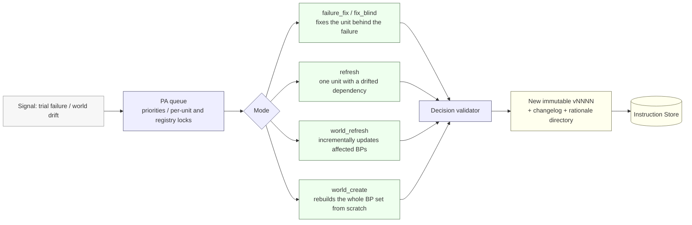

# Process Architect: Architecture

*How the BitGN ECOM1 agent is built: the agent's operating manual is a versioned codebase of business processes, executed by **Executor** and evolved between tasks by **Process Architect**.*

---

## Architecture in 60 Seconds

The core principle is to treat the agent's working instructions as code and apply engineering practices to them. Executor's operating manual is not a monolithic prompt, but a set of modular, versioned **immutable units** (business processes). The competition world (documentation, tools, DB schema) acts as the *upstream* that units explicitly depend on.

For each task, Resolver selects a unit version whose `sha256`-pinned dependencies match the current world state. If there is no exact match, it falls back to the latest active version, and Executor receives a precise diff of the mismatches. Process Architect generates new unit versions based on feedback and world drift. Depending on configuration, this happens in the background while execution continues, or the task blocks until adaptation completes, similar to fixing a failed CI run.



*Diagram 1. The whole system for one trial. Blue is deterministic code; green is models (Executor, Process Architect); yellow is the versioned store; gray is the world and final answer. LLMs are isolated to two nodes, while the rest of the logic is computed deterministically.*

---

## Responsibilities

| Component | What it is | Implementation | Responsibility |
| --- | --- | --- | --- |
| **Orchestrator** | deterministic Python | code | BitGN harness loop, world dump into `task_dir`, Executor and PA launch, reporting |
| **Fingerprints + World baseline** | `sha256` index + world snapshot | code | drift detection, relocation map (hash-based renames), baseline promotion |
| **Resolver** | version selection algorithm | code | dependency match-or-fallback, `task_dir` assembly, attention package |
| **Instruction Store** | `units/<id>/vNNNN/` + `registry.json` | data | versioned immutable source of truth for Executor prompts |
| **Executor** | `claude -p`, Sonnet (`claude-sonnet-4-6`) | **model** | solves the task through the single `execute_python` tool and calls `submit_and_exit(...)` |
| **Process Architect** | `claude`, Opus (`claude-opus-4-8`) | **model** | publishes new unit versions from feedback and drift analysis |

The key separation: the framework is deterministic code, while LLMs are used only for reasoning (task solving) and design (process modification).

---

## Models and Executor Runtime

By default, **Executor** uses the Sonnet class (`claude-sonnet-4-6`), while **Process Architect** uses the more resource-intensive Opus class (`claude-opus-4-8`). Both models and their runtime parameters are configurable. New process design is delegated to the stronger model, while routine task execution follows stable instructions on the baseline model.

Both roles run through `claude -p` (Claude Code CLI in headless mode). The current runtime is tied to the vendor CLI, although the prompts are semantically independent. Migration to an OpenAI-compatible API is planned as the next architectural step.

Executor has access to **only one runtime tool: `execute_python`** (an MCP server). The model does not access the host shell and does not use a set of specialized tools. Instead, it generates short Python snippets that execute inside the task VM, then finishes by calling `submit_and_exit(message, outcome, refs)`. All state reads, SQL queries, and `/bin/*` calls are routed through Python. This approach was borrowed from Operation Pangolin, the winner of the previous competition.

---

## Instructions as Code

The Executor prompt is built from **units**. A unit is either the system core (`executor_core`, rendered into `CLAUDE.md`) or a business process (`bp_*`, rendered into `business_processes/<name>.md`). There are currently 21 active units: the core and 20 business processes, including `identity_and_auth`, `checkout`, `discount`, `fraud_risk_review`, `payments_3ds_recovery`, `returns`, `availability_and_inventory`, `dispatch_planning`, `purchase_request_crosslist`, `refs`, `submission_terminal`, and others.

Each unit version is stored as an immutable `vNNNN/` directory with content and a manifest. The manifest contains:

* `parent`: reference to the previous version.
* `mode` / `trigger`: context in which the version was created (PA mode, failed task, score, rationale directory).
* `dependencies`: list of world files (**each pinned by `sha256`**) that the unit depends on.
* `rationale`: textual rationale for the changes.
* `rollback`: degradation rollback strategy.

A `sha256` dependency pins a unit to a specific world state.

---

## World as Upstream and Drift Handling

The "world" includes elements that the organizer may change between runs: `/AGENTS.MD`, `/docs` documentation, `/bin/*` tool surface (`--help`), and the DB schema. `instructions/world.json` describes fundamental files and includes the `affects_units` flag:

* **per-unit (`affects_units: true`)**: narrow fan-out. File drift affects only units that explicitly depend on it, for example `/AGENTS.MD` -> `bp_refs` and `bp_submission_terminal`; `/bin/checkout --help` -> `bp_checkout`.
* **world-only**: cross-cutting dependencies (`sqlite_schema.txt`, `/bin/sql --help`) that affect most processes. They are updated through `world_refresh` without per-component fan-out to reduce noise.

Drift is computed by comparing the current world against the **baseline** (`world_baseline/vNNNN/`) through a `sha256` index (`fingerprints`). A two-level **relocation map** handles moves:

* **Identical move**: file path changed, but `sha256` is the same. The path is updated automatically without producing a diff.
* **Move with mutation**: there is no byte-identical match, but token-similarity analysis links the old and new files. The reference is updated, and changed fragments are included in the diff.



*Diagram 2. Drift analysis. Hashes allow renamed files to be handled correctly without false delete/create signals.*

---

## Resolver and Attention Package

Resolver handles **every task** with a *match-or-fallback* pattern. For each unit, it selects a version whose dependencies match the current world. If there is no match, it falls back to the latest stable version. The build is rendered into `task_dir` (`CLAUDE.md` + `business_processes/*.md`), forming the final prompt for Executor.

In parallel, an **attention package** with diffs is created in `task_dir`: changes to fundamental files (`attention/world-diffs/`), changes to targeted dependencies (`attention/unit-diffs/<bp>/`), and the relocation map. Data is delivered to Executor through two channels:

* **Global context (`business_processes/CLAUDE.md`)**: a system-level warning about drift in fundamental files or a relocation map trigger. Executor analyzes this before moving to business processes.
* **Local warning (inside the process file)**: if a specific process dependency is stale and fallback was applied, a `Heads-up` block is inserted at the start of the file with the stale status and links to exact diffs (`attention/unit-diffs/<unit>/...`). The warning is isolated within the affected process.

Stale-unit behavior is controlled by `STALE_RESOLUTION`: `latest_async_refresh` (Executor uses the latest version while updates run in the background) or `wait_for_refresh` (wait for refresh before Executor starts).

**Example mutation awareness:** In one run, the attention package detected two critical changes:

* Directory move: `/proc/payment-ledger` -> `/proc/payments`
* Format change: `TRUE(1)`/`FALSE(0)` -> `<YES>`/`<NO>`

Integrating the diff directly into the prompt lets the agent adapt on the fly without manually reworking its logic. Resolver's choice is recorded in `instruction-selection.json` for later audit.

---

## Task Lifecycle



*Diagram 3. Task pipeline. Prompt preparation is deterministic; the LLM is used only during execution.*

1. Orchestrator receives the task and captures a **snapshot of the current world** in `task_dir`: documentation, `/bin/*` tool surface with `--help`, and DB schema. The build follows cross-references transitively (bounded BFS), creating a connected policy graph.
2. Resolver selects unit versions. If drift is detected, it creates an attention package, either global in `CLAUDE.md` or local to a specific business process.
3. The prompt is rendered into `CLAUDE.md` + `business_processes/`.
4. Executor (`claude -p`) starts with a single runtime tool, MCP `execute_python`: it writes short Python snippets executed in the task VM, reads state and policies **before** mutations, passes gates and `verify`, and ends with `submit_and_exit(message, outcome, refs)`.
5. If the grader returns a score (DEV/submitted modes), failed runs go to the Process Architect queue. In the **blind PROD window**, adaptation relies only on attention packages.

---

## Process Architect Loop

Process Architect (PA) works as an automated engineering agent. Based on feedback, it publishes new unit versions. Four operating modes are supported:



*Diagram 4. Process evolution loop. The queue and validation are implemented in code; refactoring logic is executed by the model.*

* **`failure_fix` / `fix_blind`**: analyze a failed task when a score or trace is available, and fix the problematic unit.
* **`refresh`**: targeted unit update when its direct dependency changes.
* **`world_refresh`**: incremental process updates when fundamental files drift.
* **`world_create`**: full process rebuild when the world changes radically, for example during dev -> prod transition.

The queue manages priorities and locks (per-unit and registry) to prevent conflicts between parallel sessions. Before commit, decisions pass deterministic validation. **Content changes are disabled by default**: drift is surfaced to Executor, but automatic process rewrites require explicit activation.

**Example (`failure_fix`)**: Task `t080` scored 0.6 instead of 1.0. The logic and references were correct, but the agent added explanatory text instead of the required isolated token `TRUE(1)`. PA localized the problem in `bp_submission_terminal` and published a new version with a strict answer-format rule and an anti-pattern. The change was applied at the task-class level.

---

## Prompt Structure and Processes

The prompt is split into a core and routable processes, organized like a codebase.

**System core (`executor_core` -> `CLAUDE.md`)**: A stable scaffold. It defines the role, runtime boundaries, source-of-truth hierarchy, `state` contract, evidence ledger structure, outcome codes, and answer format. Hard rule: **always start with `index.md`, then open only the target processes**. The core is outside Process Architect's responsibility.

**Router (`index.md` / `bp_index`)**: Defines process selection logic based on request parameters. Contains baseline cross-cutting principles, such as identity checks only through `/bin/id` and ignoring claims made in the user prompt.

**Business processes**: Each process has a strict structure (`When to use` / `Inputs` / `Process` / `Outcomes` / `Evidence ledger` / `Anti-patterns` / `Dependencies`) and falls into two categories:

* **Domain processes**: commercial scenarios (`product_discovery`, `availability_and_inventory`, `checkout`, `fraud_risk_review`, and so on).
* **Cross-cutting units**: applied globally (`identity_and_auth`, `privacy_and_disclosure`, `refs`, `submission_terminal`, `policy_update_scan`, and others).

---

## Observability and Audit Trail

The agent is logged like conventional software. Each task stores a set of artifacts:

* `CLAUDE.md` + `business_processes/`: the final rendered prompt.
* `vault/`, `bin-help/`, `tree.md`: current world dump.
* `attention/`: drift diffs and relocation map.
* `answer.json` / `result.json`: answer data, score, timings, MCP call statistics.
* `.logs/python/` + `.logs/mcp-tool-calls.jsonl`: logs of all executed `execute_python` snippets.
* `.logs/instruction-selection.json`: snapshot of Resolver behavior.

Every PA-initiated change creates a new version with a changelog and rationale directory. Runs are compared through `instruction-selection.json`, because the original task text in `task.md` is randomized.

---

## Repository Map

```text
orchestrator/        # deterministic Python: harness loop, resolver, PA queue
instructions/        # versioned source of truth
  registry.json      #   unit registry
  world.json         #   map of fundamental world files
  units/<id>/vNNNN/  #   immutable unit versions
  prompts/process_architect/   # PA prompts
static-instructions/ # runtime static files copied into task_dir (runtime_prelude.py, workspace.py)
runs/                # run archives

```

---

## Problems and Solutions

**1. Correct logic but incorrect evidence formatting.** The agent performed the business logic successfully, but lost points because of extra or missing evidence references (`refs`). The grader requires an exact format match.

* **Solution:** Reference collection was separated into its own logic layer with per-task-class rules.

**2. DB schema interaction errors.** The model generated SQL queries before fully analyzing the schema, which caused syntax errors and incorrect interpretation of EAV properties.

* **Solution:** Compact schema gotchas were added to the help output. Hardcoded SQL examples were removed from the core. Python wrappers were added for safer DB access and error interception.

**3. World drift and file renames.** Regular changes to filenames and `/proc` structure were interpreted by a standard diff as file deletion/creation.

* **Solution:** SHA256-based file matching was implemented. The agent uses the relocation map to restore paths automatically.

**4. Context overflow.** As the world scaled, context size exceeded 250-300k tokens.

* **Solution:** Manual decomposition was performed, and strict domain-process isolation was introduced.

---

## Postmortem Fixes

**1. Excessive world dump filtering.**

* **Problem:** To reduce noise, the dump was limited to documents with direct references. In the PROD world, the format changed: instead of cross-references, it used a general directive to "read everything in `/docs`". The filter cut out one third of the documents, costing 8-10 points.
* **Solution:** Filtering was disabled, and the full `/docs` contents were included in the dump.

**2. Lowered priority of injection detection.**

* **Problem:** The prompt-injection handling rule (`OUTCOME_DENIED_SECURITY`) got buried in specific business processes. The agent sometimes continued working even after detecting an injection. This cost roughly 2-3 points.
* **Solution:** Request-integrity and security-denial rules were moved to the system prompt level (`executor_core`).

**3. Global evidence collection.**

* **Problem:** `refs` collection rules were aggregated into one global layer, reducing precision.
* **Solution:** The global layer now handles only path canonicalization. Evidence collection logic was delegated to target processes, for example checkout handles baskets, fraud handles payments.

**4. Process Architect fix layering.**

* **Problem:** When PA made mistakes, it often modified the first business process visible in the trace, ignored the actual problem layer, and stacked new patches on top of its own regressions.
* **Solution:** PA prompts now include layer classification (`domain_policy`, `topic_evidence`, `refs_safety`, `terminal_protocol`, `routing`). PA now modifies only the appropriate layer.

---

## Development Plans

* **CLI agnosticism:** Move to an OpenAI-compatible API to avoid depending on a specific provider.
* **Version management through eval:** Add automatic rollback or retirement of versions based on statistically significant metrics.
* **Cross-review:** Use a dedicated LLM auditor role to check the quality of PA-generated instructions.
* **Model routing:** Dynamically assign tasks to models of different capability levels: baseline models for established routine processes, stronger models for complex reasoning.
* **REPL access for PA:** Give Process Architect access to the live world so it can test tooling before releasing an updated instruction.

---

## ECOM1 Lessons

* **Delegating code writing to models reduces nondeterminism.** Using Python scripts for actions instead of a rigid set of UI/CLI tools localizes all logic (SQL, calls, mutations) into one observable channel. This lets the model focus on reasoning within business-process boundaries.
* **High upfront implementation costs are justified.** Using stronger models at the start pays off by stabilizing processes. Cost optimization, such as routing to cheaper models, is better done only after a reliable architecture is in place.
* **Lack of feedback requires minimalist process design.** In blind runs with no score, an error in one process can fail a whole task class. In these conditions, a minimal set of hard rules is safer than overloaded, untrusted processes.
* **Processes need regular refactoring.** Targeted fixes accumulate technical debt in instruction logic over time. Periodic review and manual decomposition are required.
* **When building processes on top of world policies, reference the source and minimize paraphrase.** Every rule should point to where it came from; otherwise, when the world changes, it is hard to know what to fix and where. A live fact is better referenced than restated inside a process: a paraphrased rule drifts away from the source over time, while a reference does not. The manifest `Dependencies` block partially addressed this, but it turned out to be too weak as a "rule -> source" trace.
