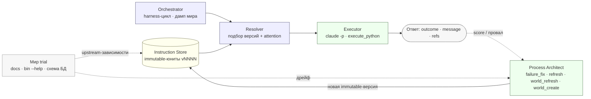
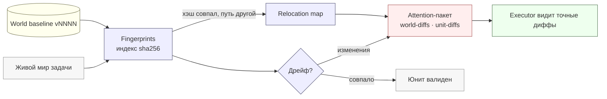
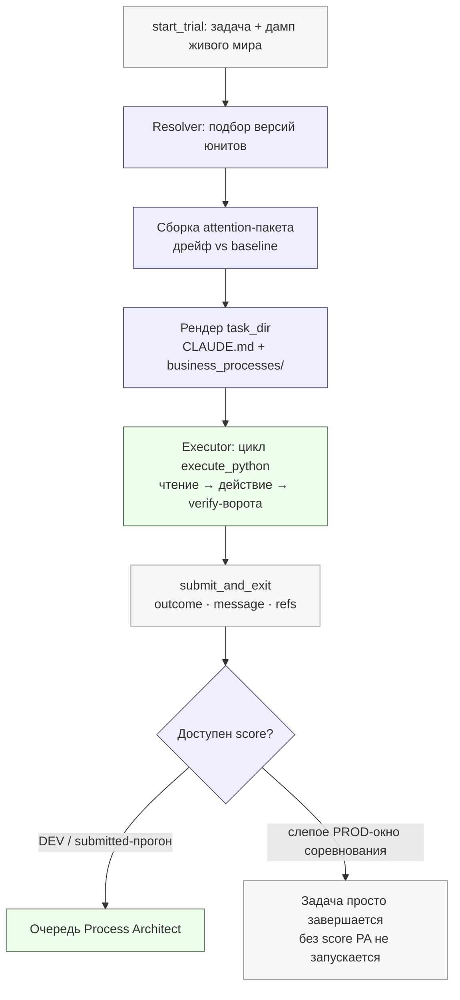
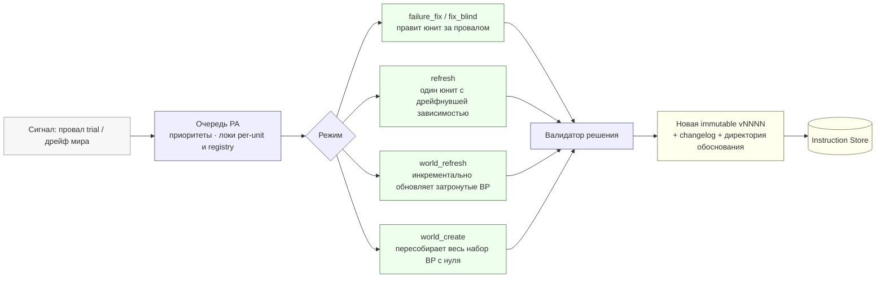

# Process Architect — архитектура

*Как устроен агент для BitGN ECOM1: операционный мануал агента — это версионируемая кодовая база бизнес-процессов, которую **Executor** исполняет, а **Process Architect** развивает между задачами.*

---

## Архитектура за 60 секунд

Основной принцип — отношение к рабочим инструкциям агента как к коду с применением инженерных практик. Операционный мануал Executor'а представляет собой не монолитный промпт, а набор модульных версионируемых **immutable-юнитов** (бизнес-процессов). Мир соревнования (документация, инструменты, схема БД) выступает как *upstream*, от которого юниты зависят явно.

Под каждую задачу Resolver подбирает версию юнита, чьи зафиксированные по `sha256` зависимости совпадают с текущим состоянием мира. При отсутствии полного совпадения происходит откат на последнюю активную версию, а Executor получает точный diff расхождений. Process Architect генерирует новые версии юнитов на основе обратной связи и дрейфа мира. В зависимости от настроек, это происходит в фоне параллельно выполнению, либо задача блокируется до завершения адаптации (по аналогии с починкой упавшего CI).



*Схема 1. Система целиком за один trial. Голубое — детерминированный код; зелёное — модели (Executor, Process Architect); жёлтое — версионируемый стор; серое — мир и финальный ответ. LLM изолированы в двух узлах, остальная логика вычисляется детерминированно.*

---

## Кто за что отвечает

| Компонент | Что это | Исполнитель | Зона ответственности |
| --- | --- | --- | --- |
| **Orchestrator** | детерминированный Python | код | harness-цикл BitGN, дамп мира в task_dir, запуск Executor и PA, отчетность |
| **Fingerprints + World baseline** | индекс `sha256` + снапшот мира | код | обнаружение дрейфа, relocation map (переименования по хэшу), продвижение базлайна |
| **Resolver** | алгоритм подбора версий | код | match-or-fallback по зависимостям, сборка `task_dir` и attention-пакета |
| **Instruction Store** | `units/<id>/vNNNN/` + `registry.json` | данные | версионируемый immutable-источник правды для промпта Executor'а |
| **Executor** | `claude -p`, Sonnet (`claude-sonnet-4-6`) | **модель** | решение задачи через единственный инструмент `execute_python`, вызов `submit_and_exit(...)` |
| **Process Architect** | `claude`, Opus (`claude-opus-4-7`) | **модель** | выпуск новых версий юнитов на базе обратной связи и анализа дрейфа |

Ключевое разделение: фреймворк реализован как детерминированный код, а LLM используются исключительно для рассуждений (решение задач) и проектирования (модификация процессов).

---

## Модели и рантайм Executor'а

По умолчанию **Executor** использует класс Sonnet (`claude-sonnet-4-6`), а **Process Architect** — более ресурсоемкий класс Opus (`claude-opus-4-7`). Обе модели и параметры их работы настраиваются. Проектирование новых процессов делегировано более мощной модели, а потоковое выполнение задач по стабильным инструкциям — базовой.

Обе роли запускаются через `claude -p` (Claude Code CLI в headless-режиме). Текущий рантайм связан с вендорным CLI, хотя семантически промпты независимы. Переход на OpenAI-совместимый API запланирован как следующий архитектурный шаг.

У Executor'а доступен **только один рантайм-инструмент — `execute_python`** (MCP-сервер). Модель не обращается к хостовому шеллу и не использует набор узкоспециализированных инструментов. Вместо этого она генерирует короткие Python-сниппеты, которые исполняются в VM задачи, и завершает работу вызовом `submit_and_exit(message, outcome, refs)`. Все операции чтения состояния, SQL-запросы и вызовы `/bin/*` маршрутизируются через Python (подход заимствован у Operation Pangolin, победителя прошлого соревнования).

---

## Инструкции как код

Промпт Executor'а формируется из **юнитов**. Юнит — это либо системное ядро (`executor_core`, рендерится в `CLAUDE.md`), либо бизнес-процесс (`bp_*`, рендерится в `business_processes/<name>.md`). На данный момент активно 21 юнит: ядро и 20 бизнес-процессов (включая `identity_and_auth`, `checkout`, `discount`, `fraud_risk_review`, `payments_3ds_recovery`, `returns`, `availability_and_inventory`, `dispatch_planning`, `purchase_request_crosslist`, `refs`, `submission_terminal` и другие).

Каждая версия юнита хранится в виде immutable-директории `vNNNN/` с контентом и манифестом. Манифест содержит:

* `parent` — ссылку на предыдущую версию.
* `mode` / `trigger` — контекст создания версии (режим PA, упавшая задача, score, директория обоснования).
* `dependencies` — список файлов мира (**каждый с зафиксированным `sha256`**), от которых зависит юнит.
* `rationale` — текстовое обоснование изменений.
* `rollback` — стратегию отката при деградации метрик.

Зависимость с `sha256` фиксирует юнит на конкретном состоянии мира.

---

## Мир как upstream и обработка дрейфа

«Мир» включает элементы, которые организатор может изменять между прогонами: `/AGENTS.MD`, документацию `/docs`, поверхность инструментов `/bin/*` (`--help`), схему БД. Файл `instructions/world.json` описывает фундаментальные файлы и содержит флаг `affects_units`:

* **per-unit (`affects_units: true`)**: узкий fan-out. Дрейф файла затрагивает только те юниты, которые явно от него зависят (например, `/AGENTS.MD` → `bp_refs` и `bp_submission_terminal`; `/bin/checkout --help` → `bp_checkout`).
* **world-only**: сквозные зависимости (`sqlite_schema.txt`, `/bin/sql --help`), влияющие на большинство процессов. Их обновлением управляет `world_refresh` без покомпонентного fan-out для снижения шума.

Дрейф вычисляется путем сравнения текущего мира с **базлайном** (`world_baseline/vNNNN/`) по индексу `sha256` (`fingerprints`). Для обработки перемещений используется двухуровневый **relocation map**:

* **Идентичное перемещение**: путь файла изменился, но `sha256` совпадает. Путь обновляется автоматически без создания diff-а.
* **Перемещение с мутацией**: байт-идентичного совпадения нет, но анализ токен-схожести связывает старый и новый файлы. Ссылка обновляется, а измененные фрагменты передаются в diff.



*Схема 2. Анализ дрейфа. Использование хэшей позволяет корректно обрабатывать переименования файлов без ложных срабатываний на удаление/создание.*

---

## Resolver и attention-пакет

Резолвер обрабатывает **каждую задачу** по паттерну *match-or-fallback*. Для каждого юнита выбирается версия, чьи зависимости совпадают с текущим миром. При отсутствии совпадений применяется fallback на последнюю стабильную версию. Сборка рендерится в `task_dir` (`CLAUDE.md` + `business_processes/*.md`), формируя итоговый промпт для Executor'а.

Параллельно формируется **attention-пакет** с диффами в `task_dir`: изменения фундаментальных файлов (`attention/world-diffs/`), изменения точечных зависимостей (`attention/unit-diffs/<bp>/`) и relocation map. Данные доставляются Executor'у через два канала:

* **Глобальный контекст (файл `business_processes/CLAUDE.md`)**: предупреждение на уровне системы о дрейфе фундаментальных файлов или срабатывании relocation map. Executor анализирует это до перехода к бизнес-процессам.
* **Локальное предупреждение (внутри файла процесса)**: если зависимость конкретного процесса устарела и применен fallback, в начало файла вставляется блок `Heads-up` с указанием на устаревший статус и ссылками на точные диффы (`attention/unit-diffs/<unit>/…`). Предупреждение изолировано в рамках затронутого процесса.

Поведение для устаревших юнитов регулируется параметром `STALE_RESOLUTION`: `latest_async_refresh` (Executor использует последнюю версию, обновления идут в фоне) или `wait_for_refresh` (ожидание обновления до запуска Executor'а).

**Пример внимания к мутациям:** В одном из прогонов attention-пакет выявил два критичных изменения:

* Перенос директории: `/proc/payment-ledger` → `/proc/payments`
* Изменение формата: `TRUE(1)`/`FALSE(0)` → `<YES>`/`<NO>`

Интеграция диффа напрямую в промпт позволяет агенту адаптироваться на лету без необходимости ручной переработки логики. Выбор резолвера фиксируется в `instruction-selection.json` для последующего аудита.

---

## Жизненный цикл задачи



*Схема 3. Пайплайн задачи. Подготовка промпта детерминирована, LLM задействована только на этапе исполнения.*

1. Orchestrator получает задачу и снимает **слепок текущего мира** в `task_dir` (документация, поверхность инструментов `/bin/*` вместе с их `--help`, схема БД). Сборка идет транзитивно по кросс-ссылкам (BFS с лимитом), формируя связный граф политик.
2. Resolver подбирает версии юнитов. При обнаружении дрейфа формируется attention-пакет (глобальный в `CLAUDE.md` или локальный в конкретном бизнес-процессе).
3. Промпт рендерится в `CLAUDE.md` + `business_processes/`.
4. Executor (`claude -p`) запускается с единственным рантайм-инструментом — MCP `execute_python`: он пишет короткие Python-сниппеты, исполняемые в VM задачи, читает состояние и политики **до** мутаций, проходит ворота и `verify`, и заканчивает вызовом `submit_and_exit(message, outcome, refs)`.
5. Если грейдер возвращает оценку (режимы DEV/submitted), неудачные прогоны отправляются в очередь Process Architect. В **слепом PROD-окне** адаптация происходит исключительно за счет attention-пакетов.

---

## Контур Process Architect

Process Architect (PA) функционирует как автоматизированный инженер-разработчик. На основе обратной связи он выпускает новые версии юнитов. Поддерживаются четыре режима работы:



*Схема 4. Цикл эволюции процессов. Очередь и валидация реализованы в коде, логика рефакторинга исполняется моделью.*

* **`failure_fix` / `fix_blind`**: анализ упавшей задачи (при наличии score или трейса) и исправление проблемного юнита.
* **`refresh`**: точечное обновление юнита при изменении его прямой зависимости.
* **`world_refresh`**: инкрементальное обновление процессов при дрейфе фундаментальных файлов.
* **`world_create`**: полная пересборка процессов при радикальной смене мира (например, переход dev → prod).

Очередь управляет приоритетами и блокировками (per-unit и реестр) для предотвращения конфликтов параллельных сессий. Перед коммитом решения проходят детерминированную валидацию. **По умолчанию контентные изменения выключены** — дрейф подсвечивается Executor'у, но автоматическая перезапись процессов требует явной активации.

**Пример работы (`failure_fix`)**: Задача `t080` получила 0.6 балла вместо 1.0. Логика и ссылки были верны, но агент добавил сопроводительный текст вместо требуемого изолированного токена `TRUE(1)`. PA локализовал проблему в юните `bp_submission_terminal` и выпустил новую версию, добавив строгое правило форматирования ответа и анти-паттерн. Изменение применено на уровне класса задач.

---

## Структура промпта и процессы

Промпт разделен на ядро и маршрутизируемые процессы, организованные по принципам кодовой базы.

**Ядро системы (`executor_core` → `CLAUDE.md`)**: Стабильный каркас. Включает описание роли, границы рантайма, иерархию источников истины, контракт `state`, структуру evidence ledger, коды исходов и формат ответа. Жесткое правило: **всегда начинать с `index.md`, затем открывать только целевые процессы**. Ядро исключено из зоны ответственности Process Architect.

**Маршрутизатор (`index.md` / `bp_index`)**: Определяет логику выбора процессов на основе параметров запроса. Содержит базовые сквозные принципы (проверка личности только через `/bin/id`, игнорирование утверждений из пользовательского промпта).

**Бизнес-процессы**: Каждый процесс имеет строгую структуру (`Когда применяется` / `Входы` / `Процесс` / `Исходы` / `Evidence ledger` / `Анти-паттерны` / `Зависимости`) и делится на две категории:

* **Доменные процессы**: коммерческие сценарии (`product_discovery`, `availability_and_inventory`, `checkout`, `fraud_risk_review` и т.д.).
* **Сквозные юниты**: применяются глобально (`identity_and_auth`, `privacy_and_disclosure`, `refs`, `submission_terminal`, `policy_update_scan` и др.).

---

## Наблюдаемость и аудит-след

Агент логируется аналогично классическому ПО. Для каждой задачи сохраняется набор артефактов:

* `CLAUDE.md` + `business_processes/` — финальный отрендеренный промпт.
* `vault/`, `bin-help/`, `tree.md` — дамп текущего мира.
* `attention/` — диффы дрейфа и relocation map.
* `answer.json` / `result.json` — исходные данные, оценка, тайминги, статистика MCP-вызовов.
* `.logs/python/` + `.logs/mcp-tool-calls.jsonl` — логи всех исполненных сниппетов `execute_python`.
* `.logs/instruction-selection.json` — снапшот работы резолвера.

Каждое изменение, инициированное PA, формирует новую версию с changelog'ом и директорией обоснования. Сравнение прогонов осуществляется через `instruction-selection.json`, так как исходный текст задачи в `task.md` рандомизируется.

---

## Карта репозитория

```
orchestrator/        # детерминированный Python: harness-цикл, резолвер, очередь PA
instructions/        # версионируемый источник правды
  registry.json      #   реестр юнитов
  world.json         #   карта фундаментальных файлов мира
  units/<id>/vNNNN/  #   immutable-версии юнитов
  prompts/process_architect/   # промпты PA 
static-instructions/ # рантайм-статика, копируется в task_dir (runtime_prelude.py, workspace.py)
runs/                # архивы прогонов

```

---

## Проблемы и решения

**1. Верная логика, но некорректное оформление доказательств.** Агент успешно выполнял бизнес-логику, но терял баллы из-за лишних или недостающих ссылок-доказательств (`refs`). Грейдер требует точного совпадения формата.

* **Решение:** Процесс сбора `refs` выделен в отдельный слой логики с индивидуальными правилами под каждый класс задач.

**2. Ошибки взаимодействия со схемой БД.** Модель генерировала SQL-запросы до полного анализа схемы, что приводило к синтаксическим ошибкам и неверной трактовке EAV-свойств.

* **Решение:** В справку внедрены компактные описания нюансов схемы («gotchas»). Захардкоженные примеры SQL удалены из ядра. Добавлены Python-обертки для безопасной работы с БД и перехвата ошибок.

**3. Дрейф мира и переименования файлов.** Регулярные изменения имен файлов и структуры `/proc` воспринимались стандартным diff как удаление/создание файлов.

* **Решение:** Внедрено сопоставление файлов по SHA256. Агент использует relocation map для автоматического восстановления путей.

**4. Переполнение контекста.** При масштабировании мира объем контекста превышал 250–300k токенов.

* **Решение:** Проведена ручная декомпозиция и внедрена жесткая изоляция доменных процессов.

---

## Работа над ошибками (postmortem)

**1. Избыточная фильтрация дампа мира.**

* **Проблема:** Для снижения шума дамп был ограничен только документами, на которые есть прямые ссылки. В PROD-мире формат изменился — вместо перекрестных ссылок использовалась общая директива «читать всё из `/docs`». Фильтр отсек треть документы, что привело к потере 8-10 баллов.
* **Решение:** Отключение фильтрации и включение всего содержимого `/docs` в дамп.

**2. Снижение приоритета детектора инъекций.**

* **Проблема:** Правило обработки промпт-инъекций (`OUTCOME_DENIED_SECURITY`) затерялось в специфичных бизнес-процессах. Агент иногда продолжал работу даже после обнаружения инъекции. Это стоило примерно 2–3 балла.
* **Решение:** Правила request-integrity и security-отказов вынесены на уровень системного промпта (`executor_core`).

**3. Глобальный сбор доказательств.**

* **Проблема:** Правила сбора `refs` были агрегированы в одном глобальном слое, что снижало точность.
* **Решение:** Глобальный слой оставлен только для каноникализации путей. Логика сбора доказательств делегирована целевым процессам (например, checkout отвечает за корзины, fraud — за платежи).

**4. Наслоение исправлений Process Architect.**

* **Проблема:** При ошибках PA часто модифицировал первый попавшийся в трейсе бизнес-процесс, игнорируя реальный слой проблемы, и наслаивал новые патчи поверх собственных регрессий.
* **Решение:** В промпты PA внедрена классификация слоев (`domain_policy`, `topic_evidence`, `refs_safety`, `terminal_protocol`, `routing`). Теперь PA модифицирует только профильный слой.

---

## Планы по развитию

* **Агностичность к CLI:** Переход на использование OpenAI-compatible API для независимости от конкретного провайдера.
* **Управление версиями через eval:** Внедрение автоматического отката (rollback) или вывода из эксплуатации (retire) версий на базе статистической значимости метрик.
* **Кросс-ревью:** Использование выделенной LLM-роли аудитора для проверки качества сгенерированных PA инструкций.
* **Маршрутизация по моделям:** Динамическое назначение задач на модели разной мощности (базовые модели для устоявшихся рутинных процессов, мощные — для сложных рассуждений).
* **Доступ к REPL для PA:** Предоставление Process Architect доступа к живому миру для тестирования инструментария до релиза обновленной инструкции.

---

## Уроки ECOM1

* **Делегирование написания кода моделям снижает недетерминированность.** Использование Python-скриптов для выполнения действий вместо жесткого набора UI/CLI-инструментов локализует всю логику (SQL, вызовы, мутации) в одном наблюдаемом канале. Это позволяет модели сосредоточиться на рассуждениях, ограниченных рамками бизнес-процессов.
* **Высокие затраты на этапе внедрения оправданы.** Использование мощных моделей на старте окупается стабилизацией процессов. Оптимизацию стоимости (например, маршрутизацию на более дешевые модели) целесообразно проводить только после формирования надежной архитектуры.
* **Отсутствие обратной связи требует минималистичного дизайна процессов.** В слепых прогонах без score ошибка в одном процессе приводит к провалу всего класса задач. В таких условиях безопаснее использовать минимальный набор жестких правил, чем перегруженные недоверенные процессы.
* **Необходимость регулярного рефакторинга процессов.** Точечные исправления со временем накапливают технический долг в логике инструкций. Требуется периодический пересмотр и ручная декомпозиция структуры.
- **Строишь процессы поверх политик мира — ссылайся на источник и минимизируй пересказ.** Каждое правило должно указывать, откуда оно взято, иначе при изменении мира не понять, что и где чинить; а живой факт лучше не пересказывать в процессе, а отправлять к исходной политике — пересказанное правило со временем расходится с источником, ссылка — нет. Частично это решал манифестный блок `Dependencies`, но как трассировка «правило → источник» он оказался слишком хлипким.
