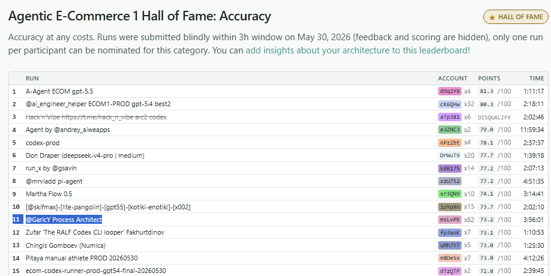
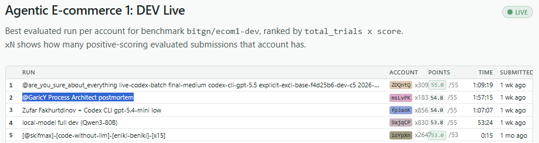
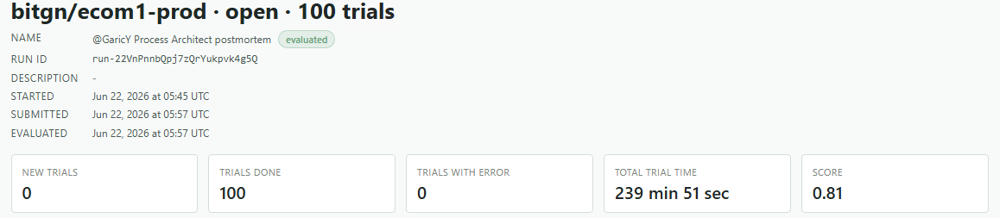
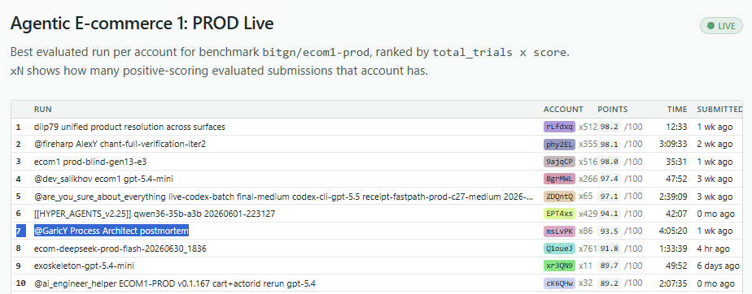

# Process Architect: Карта бизнес-процессов как код

## Глоссарий и карта репозитория

Этот README — входная точка. Он объясняет контекст соревнования, результат и главную идею проекта. Подробности разнесены по отдельным документам и артефактам:

- **Мир** — документы, инструменты, состояние и схема БД конкретного запуска BitGN.
- **Executor** — агент-исполнитель, который решает задачу по отрендеренному операционному мануалу.
- **Process Architect / PA** — агент-архитектор, который анализирует провалы и дрейф мира, а затем выпускает новые версии процессов.
- **Юнит / бизнес-процесс** — immutable-версия инструкции для конкретного класса операций: checkout, returns, fraud review, и т.д.
- **[ARCHITECTURE_RU.md](ARCHITECTURE_RU.md)** — устройство Process Architect: Instruction Store, Resolver, обработка дрейфа мира, контур PA и жизненный цикл задачи.
- **[OPERATING_RU.md](OPERATING_RU.md)** — операционный runbook: запуск, переменные окружения, режимы.
- **`runs/`** — опубликованные артефакты прогонов. `*.html` — обзорные отчеты по сериям запусков, `*.png` — скриншоты leaderboard/eval, `*.tar.gz` — архивы task_dir с `task.md`, `answer.json`, `result.json`, дампом мира (`vault/`, `bin-help/`), attention-пакетами и логами Executor'а (`.logs/`, `instruction-selection.json`, `execute_python`).

Ветки репозитория:

- **`competition-blind`** — версия, участвовавшая в основном (слепом) соревновании.
- **`postmortem-dev`** — рефакторинг и работа над ошибками в DEV-окружении.
- **`postmortem-prod`** — валидация исправлений (postmortem) на PROD-мире, эволюция.

## О соревновании

**BitGN Agent Challenge** — это серия соревнований, где автономные агенты решают задачи внутри детерминированных симуляций реального бизнеса. Выпуск **ECOM1** посвящён операционной системе интернет-магазина: агент не «болтает про товары», а делает работу магазина — ищет товары по нечётким запросам, собирает корзины, проводит checkout, восстанавливает платежи после сбоя 3DS, разбирает возвраты, считает складские остатки, ловит мошеннические платежи. И к каждому ответу прикладывает **ссылки-доказательства**.

Среда устроена как небольшая Unix-подобная система; всё нужное лежит на её верхнем уровне:

- `/AGENTS.md` — локальные правила конкретного запуска (вплоть до того, какими словами отвечать «да» и «нет»);
- `/docs` — политики: безопасность, скидки, возвраты, восстановление платежей;
- `/proc` — текущее состояние мира: товары, магазины, сотрудники, корзины, платежи;
- `/bin` — разрешённые утилиты командной строки, которыми агент действует и проверяет факты: `/bin/checkout` оформляет корзину, `/bin/id` сообщает, от чьего имени идёт запрос (нужно для проверки прав и владения), `/bin/sql` выполняет запросы к базе магазина.

Финальный вызов `answer` принимает не только сообщение пользователю, но и служебный **исход** (`OK`, отказ по безопасности, запрос уточнения, «операция не поддерживается») и список **ссылок-доказательств**. Оценивается строго наблюдаемое: какие действия совершены, какие изменения состояния записаны, приложены ли верные доказательства и соблюдён ли точный формат ответа. Красота текста не оценивается — а вот одна лишняя или пропущенная ссылка обнуляет всю задачу.

**Как выглядят задачи.** Запросы приходят человеческим языком — часто небрежным, иногда с подвохом. Два реальных примера из слепого PROD-прогона.

*1. Нечёткий запрос про наличие:*

> Do you have 8 of 'bosch gex 125 accessory set with discs' (but not PT-SND-BOS-GEX125-DUST) in stock in alpenstrasse tools place?

В одной фразе — нечёткое название товара, исключение (`but not …`), нечёткое имя магазина и порог количества. Агент находит нужный SKU и склад, считает доступность и отвечает в формате, заданном в `/AGENTS.md`.
**Ответ:** исход `OK` · `FALSE(2)` (нет; в наличии всего 2) · доказательства: запись магазина, карточка товара, `/docs/availability-checks.md`.

*2. OCR-скан → рабочий артефакт:*

> Read the uploaded competitor purchase request OCR at /uploads/…_ocr.txt and create a TSV crosslist report at /exports/crosslist-….tsv.

На входе — зашумлённый скан чужой заявки: позиции записаны кодами и словами конкурента, а не нашими. Агент по политике `/docs/purchase-request-crosslist.md` определяет филиал, сопоставляет каждую позицию нашему SKU и пишет готовый TSV-отчёт.
**Ответ:** исход `OK` · путь `/exports/crosslist-….tsv` · доказательства: OCR-файл, политика кросслиста, запись магазина и сопоставленные карточки товаров.

**Как именно проходит соревнование.** Есть две среды. На **DEV** мы готовим агента: гоняем задачи, читаем трейсы, чиним логику — и, что важно, **на DEV виден score**: грейдер оценивает каждую задачу, так что есть по чему эволюционировать. По ходу организатор подбрасывает новые задачи и подкручивает мир, и здесь главная ловушка: легко переучить агента под конкретные товары, корзины и имена файлов DEV — и так же легко на этом потом провалиться. Потому что зачёт идёт в **слепом PROD-окне**. «Слепом» в прямом смысле: PROD мы заранее не видим, а сам прогон идёт **без score** — грейдер молчит, обратной связи по задачам нет. И мир при этом может отличаться радикально: другой текст задач, другая структура состояния, переименованные файлы политик, другой набор колонок в таблицах. Гарантировано лишь немногое — это по-прежнему e-commerce, и в нём по-прежнему будут `AGENTS.md` и `/bin`.

## Результаты: Leaderboard + Работа над ошибками

**Официальный результат:** 11-е место в Hall of Fame: [Accuracy](https://bitgn.com/l/ecom1-accuracy), в общем зачёте [Ultimate](https://bitgn.com/l/ecom1-ultimate) — **15-е место**.

После конкурса была проведена работа над ошибками, в результате адаптация  dev->prod прошла более удачно.   

А после одного раунда эволюции процессов удалось взять более 90%

## Идея: Бизнес-процессы как код

Я более 15 лет занимался внедрением ERP-систем, и любой проект начинается одинаково. С чего? ~~Мы садимся писать код.~~ Мы **составляем карту бизнес-процессов.** Код приходит позже; это лишь один из способов выразить процесс, который уже существует — в регламентах, в головах людей, в том, как бизнес реально работает.

Кажется, при проектировании сложных ИИ-агентов мы сталкиваемся с похожей проблемой. Если инструкции агента растут одним гигантским монолитом, они довольно быстро становятся хрупкими и неподдерживаемыми.

> **Главная идея простыми словами:**
> Устойчивость через декомпозицию. Инструкции агента разбиты на независимые процессы с минимумом зависимостей. Когда «живой мир» (правила, утилиты, схемы БД) меняется, агент-исполнитель не ломается: он получает точный diff расхождений и адаптируется на лету. А в это время Process Architect проектирует и выпускает новые версии устаревших юнитов.

Отсюда три ключевых отличия Process Architect:

- **Инструкции агента — это код.** Операционный мануал состоит из модульных, версионируемых, immutable-юнитов (бизнес-процессов).
- **Домен вынесен из фреймворка.** Оркестратор, стор и контур архитектора ничего не знают про e-commerce. Доменное знание агент самостоятельно выводит из живого мира. Наведи ту же машину на другой бизнес — и она спроектирует новую карту процессов.
- **Бизнес-домен первичен, сценарии задач — вторичны.** При изначальном составлении карты процессов я не пытаюсь угадать, какие именно запросы прилетят агенту. Базовый мануал строится исключительно вокруг самого предприятия и его политик (как устроена корзина, как оформляется возврат). Процесс описывает как работает бизнес, а не как решить конкретный тест. Точечная подстройка под специфику реальных входящих задач происходит уже потом — естественным путем в ходе эволюции юнитов.

## Контакты

- Игорь Ласийчук
- Telegram: @GaricY
- Лендинг ECOM1: [ecom1-process-architect-site](https://garicy.github.io/ecom1-process-architect-site/?lang=ru)
- LinkedIn: https://www.linkedin.com/in/igor-lasiychuk/
